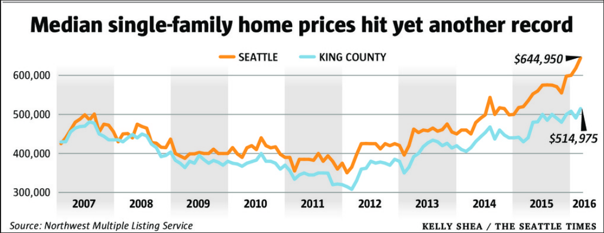
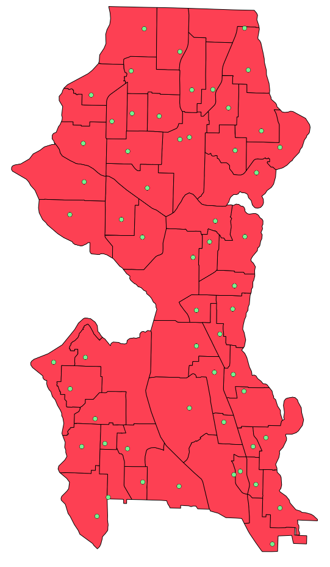
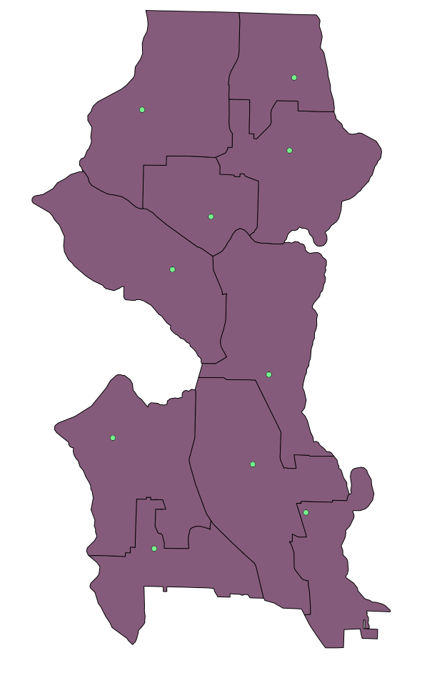
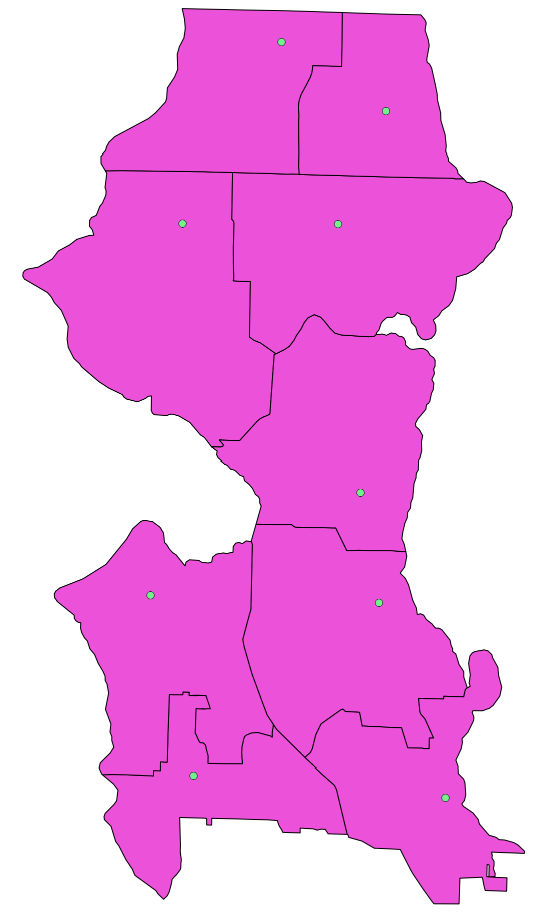
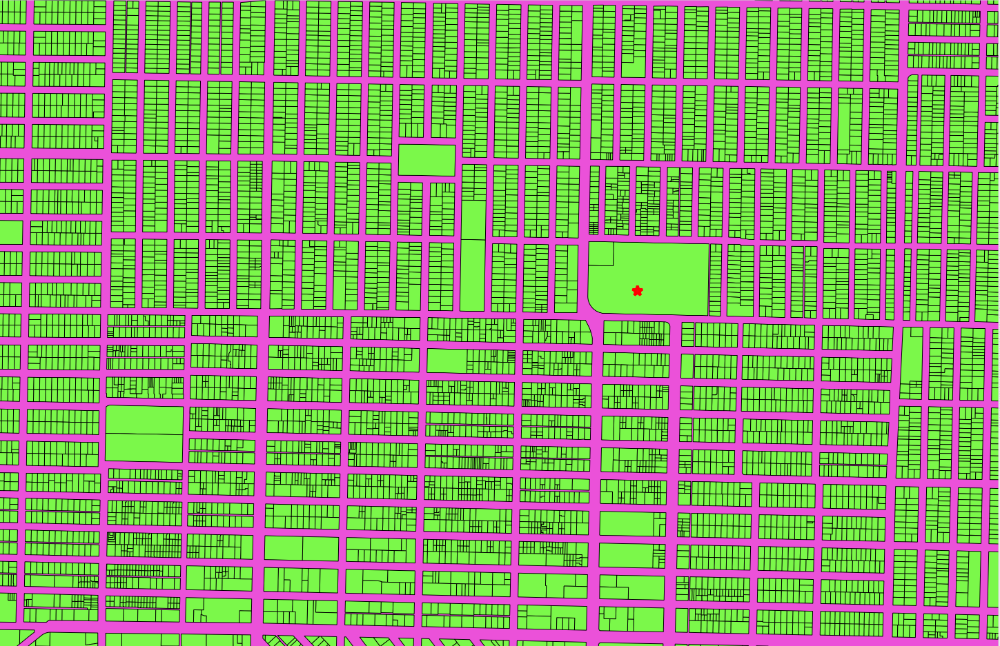
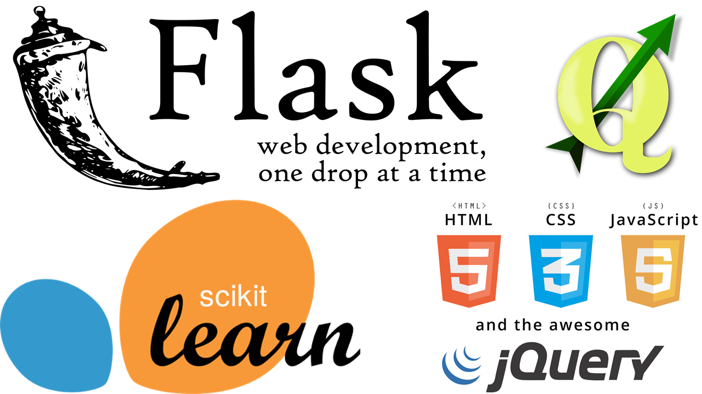

# Maximize Your Family's Real Estate Investment

## A Zipcode Recommender in city of Seattle for optimized Real-Estate and Schoolings

Seattle Real-Estate Market is booming and will continue to grow.
Living on rent is good, but buying a house is a better investment.
What are criteria for this best investment? How can you decide on the best option for what your money's worth?
You may want to consider the schooling options as well.

Here, with this app, you can find min/max housing estimates for each Zipcode and the public school ratings with respect to the assigned districts, and a comparison of the private schooling cost with respect to each kids age in the household. And, it is ok if you planning to have kids x many years down the road, the private schooling calculation captures it all...

## Data Collection:
Main data sources are:
* King County
* Seattle Public Schools
* Great School_Ratings
* Zillow

QGIS is used for associating the parcel numbers to public school districts.

Elementary School Zones

Middle School Zones

High School Zones

Sample parcel allocation to HS District: This example is using Ballard High School

## Data Cleaning:
Classic Feature Engineering methods are applied.
* Data is limited to 100,000.0$ and 2,000,000.0$ for the general purpose of the problem.
* To consider only houses, the living number of units are filtered to 2.
* For the accuracy of the model, the data prior to 1985 is discarded.

## Modelling:
Various regressors methods, with GridSearch of respective hyper-parameters, are screened; which are Random Forest Regressor, Gradient Boosting Regressor, Elastic Net CV, Support Vector Regressor, and Linear Regression. Among these, the best error margin is achieved by Random Forest Regressor, with 12.27% median absolute percent error. The best GridSearch of Gradient Boosting Regressor provided 11.30% median absolute percent error. This is also included in the codes, and the jupyter notebooks. Zillow's current median absolute percent error is 5.4 % for Seattle city.

,

## How to make the app work:

The app is going to be live soon, and the link will be posted here.

### Please follow the directions below for having the app working in your local browser.

Please download the EXTR_ResBldg.csv and EXTR_RPSale.csv from http://info.kingcounty.gov/assessor/DataDownload/default.aspx
and Residential_Building.zip and Real_Property_Sales.zip files, respectively into the data folder.

Later, run the Feature_Engineering_Functions.py, Parcel_w_ES_MS_HS_Districts.py, School_Ratings.py , and SalePrice_Modelling.py python files in the given order from src directory.

When you run the app.py python file (e.g. "python app.py" from src directory) in your terminal, you will get the html for the application which shows you the predicted housing prices for the given SqFt and number of Bedrooms in each Zipcode with the Public School Ratings, and a comparison of Private School Cost until Collage.
